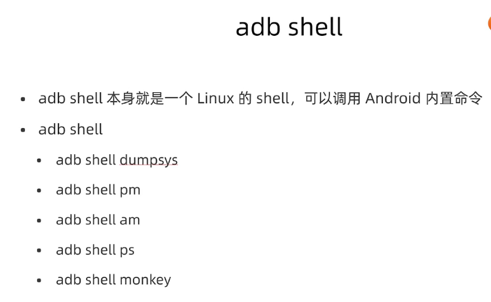
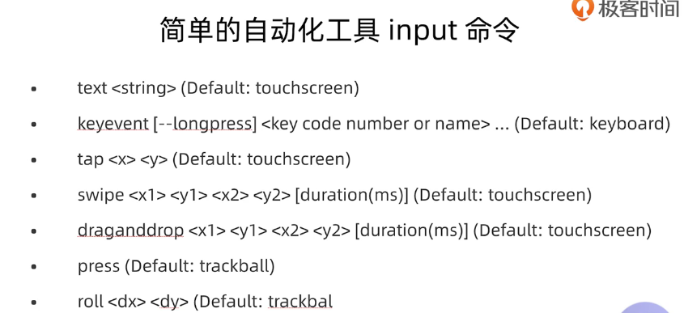
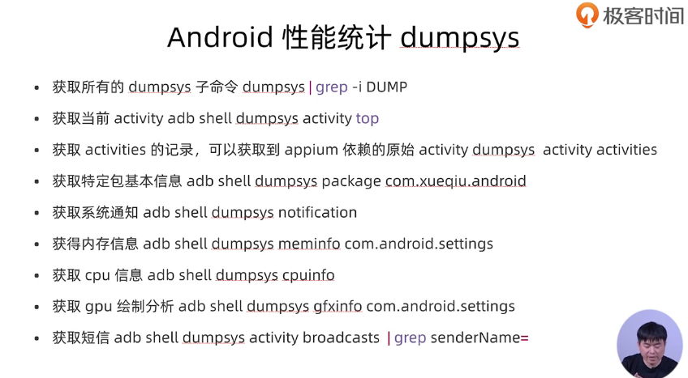

Android常用命令


## tcpip无线连接手机：

1、 连接USB数据线，打开usb调试，使用windows的“运行”命令行方式：（此方法需配置adb环境变量，也可直接进入adb工具目录执行\android-sdk-windows\platform-tools\） 

- 手机和pc处于同一局域网，手机打开usb调试模式，然后在命令行输入：

  adb tcpip 5555

- 连接手机 adb connect 192.168.0.101  (Android设备IP地址)

- adb usb  调回usb调试方式

2、 无需数据线，且可解决部分机器在方法1时出现的“unable to connect to 192.168.1.199:5555”错误
在android设备上安装 “终端模拟器”等类似shell命令工具，使用下面命令（**需root权限**）： 

```
(串口调试工具)
TCP/IP方式：
setprop service.adb.tcp.port 5555
stop adbd
start adbd
调回usb调试方式：
setprop service.adb.tcp.port -1
stop adbd
start adbd
```

 3.断开连接 

```
adb disconnect 192.168.0.101:5555
```




- adb shell pm clear com.xueqiu.android: 清理应用的数据缓存和权限
- 启动应用：`adb shell am start -n com.xueqiu.android/com.xueqiu.android/.view.WelcomeActivityAlias -S`
- 获取界面的元素，以xml节点展示：adb shell uiautomator dump
- adb shell "uiautomator dump && cat /sdcard/window_dump.xml"
- adb shell input
- 模拟触屏事件：adb shell input tap 529 1176 
- 



