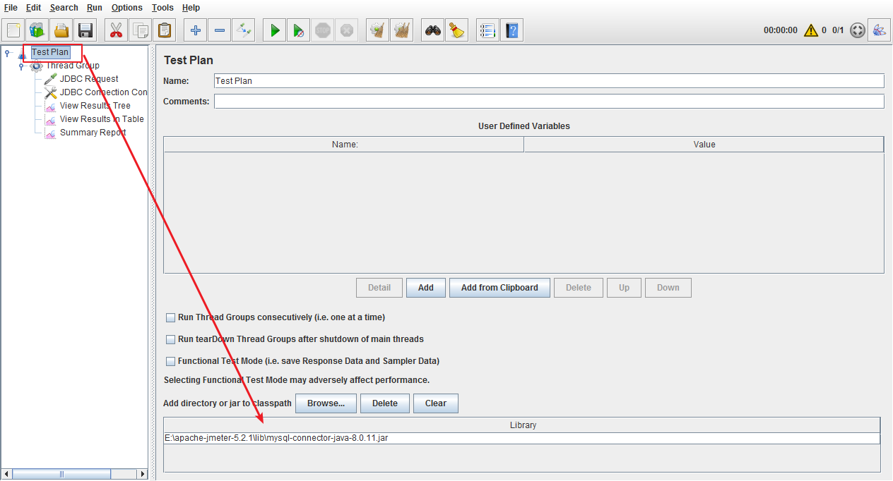
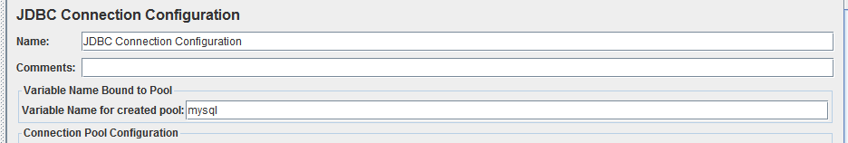
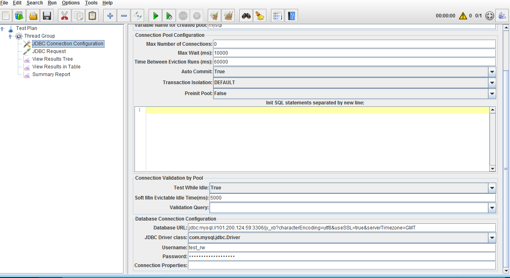
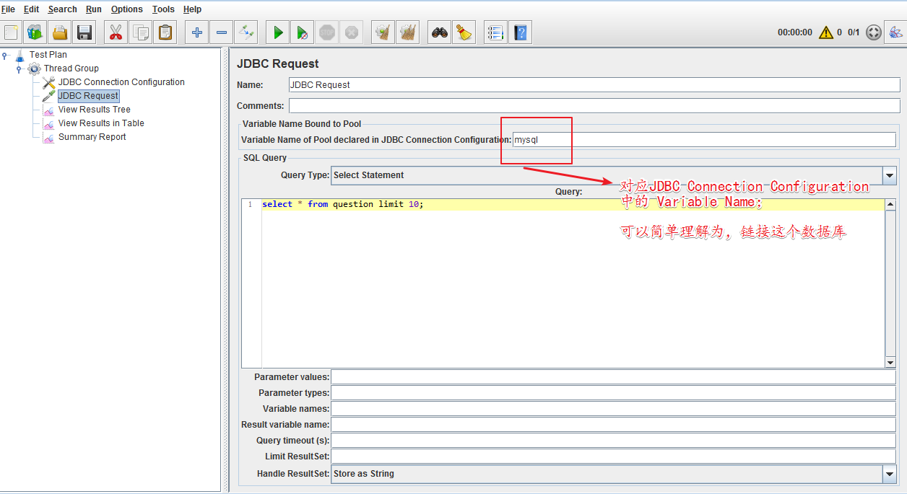

mysql-connector-java-8.0.11.jar
jdbc:mysql://localhost:3306/test?characterEncoding=utf8&useSSL=true&serverTimezone=GMT

1、测试计划中引入连接mysql的jar包

2、添加线程组，添加JDBC Connection Configuration

**Variable Name**：自定义参数，在JDBC Request中会用到；
**DatabaseURL**：格式为：jdbc:mysql:// 数据库IP地址:数据库端口/数据库名称？characterEncoding=utf8&useSSL=true&serverTimezone=GMT；

如下所示：jdbc:mysql://localhost:3306/test?characterEncoding=utf8&useSSL=true&serverTimezone=GMT

**JDBC Driver Class**：com.mysql.jdbc.Driver；

**Username**：数据库用户名；

**Password**：数据库密码；

3、添加JDBC Request

然后添加View result tree， 就可以像运行Http 请求一样执行数据库请求了