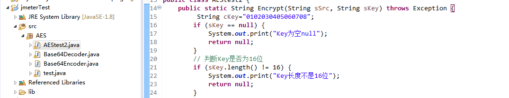
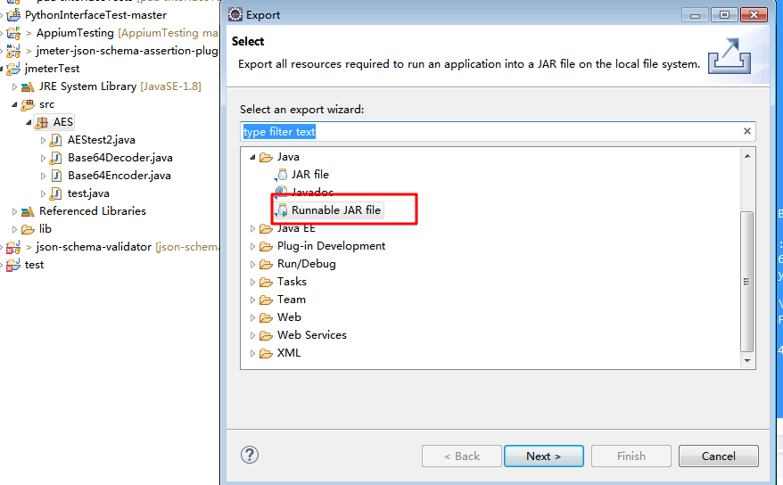
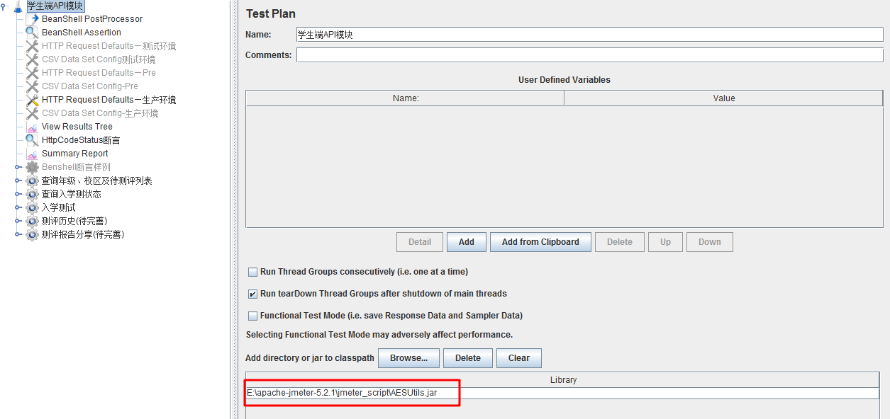
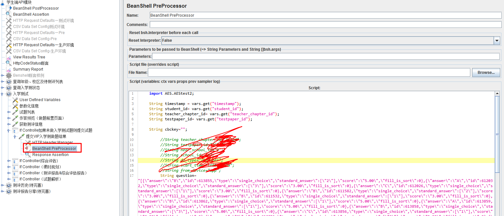

在Jmeter日常实践中，大家应该都遇到过接口传参需要加密的情况。以登陆为例，用户名和密码一般都需要进行加密传输，在服务端再进行解密，这样安全系数会更高，但在使用jmeter进行接口测试的时候，怎样发送加密的参数呢，下面以AES加密为例，来示范一下如何在jmeter中对参数进行加密。

一、AES CBC加密算法调试（java+eclipse）

首先要准备一个AES算法类，并调试算法是否可用，调试可用之后导出的jar包，详解一下步骤

1、在eclipse中新建一个java工程，我命名为了jmeterTest，可以看到jmeterTest下有src这个文件夹。然后在src文件夹下新建一个包，我命名为了AES。此时的包AES是空的，然后要在AES包中创建一个java类，我命名为了AEStest2



2、java类已经创建好了，现在要在类中添加代码了，因为需要对参数进行base64加密，所以需要用到base64加密类

主要代码：

AEStest2.java类

```java
package AES;

import java.io.UnsupportedEncodingException;

import javax.crypto.Cipher;
import javax.crypto.SecretKey;
import javax.crypto.spec.IvParameterSpec;
import javax.crypto.spec.SecretKeySpec;
import AES.Base64Decoder;

/**
 * http://blog.csdn.net/qq_33237207/article/details/53114122
 */
public class AEStest2 {
	public static String Encrypt(String sSrc, String sKey) throws Exception {  
		 String cKey="0102030405060708";
		if (sKey == null) {  
            System.out.print("Key为空null");  
            return null;  
        }  
        // 判断Key是否为16位  
        if (sKey.length() != 16) {
            System.out.print("Key长度不是16位");
            return null;  
        }  
        byte[] raw = sKey.getBytes("utf-8");  
        SecretKeySpec skeySpec = new SecretKeySpec(raw, "AES");  
        Cipher cipher = Cipher.getInstance("AES/CBC/PKCS5Padding");//"算法/模式/补码方式"  
        IvParameterSpec iv = new IvParameterSpec(cKey.getBytes());//使用CBC模式，需要一个向量iv，可增加加密算法的强度  
        cipher.init(Cipher.ENCRYPT_MODE, skeySpec, iv);  
        byte[] encrypted = cipher.doFinal(sSrc.getBytes());  
//        return new Base64.encode(encrypted);//此处使用BASE64做转码功能，同时能起到2次加密的作用。
        return  Base64Encoder.encode(encrypted).replaceAll("\r|\n", "");
        
    }
	
	public static String Decrypt(String sSrc, String sKey) throws Exception {
		String cKey="0102030405060708";
        try {  
            // 判断Key是否正确
            if (sKey == null) {  
                System.out.print("Key为空null");  
                return null;
            }
            // 判断Key是否为16位
            if (sKey.length() != 16) {
                System.out.print("Key长度不是16位");
                return null;
            }  
            byte[] raw = sKey.getBytes("utf-8");
            SecretKeySpec skeySpec = new SecretKeySpec(raw, "AES");  
            Cipher cipher = Cipher.getInstance("AES/CBC/PKCS5Padding");  
            IvParameterSpec iv = new IvParameterSpec(cKey.getBytes());  
            cipher.init(Cipher.DECRYPT_MODE, skeySpec, iv);
//            byte[] encrypted1 = new Base64Decoder (sSrc);//先用base64解密 
            byte[] encrypted1 = Base64Decoder.decodeToBytes(sSrc);

            try {
                byte[] original = cipher.doFinal(encrypted1);
                String originalString = new String(original);  
                return originalString; 
            } catch (Exception e) {  
                System.out.println(e.toString());
                return null;  
            }  
        } catch (Exception ex) {  
            System.out.println(ex.toString());  
            return null;  
        }  
    }
	public static void main(String[] args) throws Exception {  
        /* 
         * 加密用的Key 可以用26个字母和数字组成，最好不要用保留字符，虽然不会错，至于怎么裁决，个人看情况而定 
         * 此处使用AES-128-CBC加密模式，key需要为16位。 
         */  
 
        // 需要加密的字串 
        String cSrc = "{\"timestamp\":\"1605424485863\",\"student_id\":\"193430\",\"testpaper_id\":\"363331\",\"course_id\":0,\"do_type\":\"classPaper\"}";
//        String cSrc = "{"timestamp":"1605424485863","student_id":"193430","testpaper_id":"363331","course_id":0,"do_type":"classPaper"}";
        System.out.println(cSrc);
        // 加密  
        long lStart = System.currentTimeMillis();
        String enString = AEStest2.Encrypt(cSrc, "F697467B14B076F2");
        System.out.println("加密后的字串是：" + enString);
        System.out.println(enString);
        long lUseTime = System.currentTimeMillis() - lStart;
        System.out.println("加密耗时：" + lUseTime + "毫秒");
        
        //解密
        String parameter="ifUKt9UzLUZaHejCkUBFPnivsqsXObTCUaEVRFnAUzoUnUmegtyCh7cDQehTfoFvHtVtTh6DRhtj6uepwTUvRPeKi6116Q5S/qfGoNNTRxYdMAB18LQDlw4q43nanKCLfYMsH/RlaevgU5+mE1luRg==";
        String decodeString=AEStest2.Decrypt(parameter, "F697467B14B076F2");
        System.out.println("解密后："+decodeString);
       
    }
}
```

Base64Decoder.java类：

```java
package AES;

import java.io.ByteArrayInputStream;
import java.io.ByteArrayOutputStream;
import java.io.FilterInputStream;
import java.io.IOException;
import java.io.InputStream;
import java.io.UnsupportedEncodingException;

public class Base64Decoder extends FilterInputStream {

    private static final char[] chars = {'A', 'B', 'C', 'D', 'E', 'F', 'G',
            'H', 'I', 'J', 'K', 'L', 'M', 'N', 'O', 'P', 'Q', 'R', 'S', 'T',
            'U', 'V', 'W', 'X', 'Y', 'Z', 'a', 'b', 'c', 'd', 'e', 'f', 'g',
            'h', 'i', 'j', 'k', 'l', 'm', 'n', 'o', 'p', 'q', 'r', 's', 't',
            'u', 'v', 'w', 'x', 'y', 'z', '0', '1', '2', '3', '4', '5', '6',
            '7', '8', '9', '+', '/'};

    // A mapping between char values and six-bit integers
    private static final int[] ints = new int[128];

    static {
        for (int i = 0; i < 64; i++) {
            ints[chars[i]] = i;
        }
    }

    private int charCount;
    private int carryOver;

    /***
     * Constructs a new Base64 decoder that reads input from the given
     * InputStream.
     *
     * @param in
     *            the input stream
     */
    public Base64Decoder(InputStream in) {
        super(in);
    }

    /***
     * Returns the next decoded character from the stream, or -1 if end of
     * stream was reached.
     *
     * @return the decoded character, or -1 if the end of the input stream is
     *         reached
     * @exception IOException
     *                if an I/O error occurs
     */
    public int read() throws IOException {
        // Read the next non-whitespace character
        int x;
        do {
            x = in.read();
            if (x == -1) {
                return -1;
            }
        } while (Character.isWhitespace((char) x));
        charCount++;

        // The '=' sign is just padding
        if (x == '=') {
            return -1; // effective end of stream
        }

        // Convert from raw form to 6-bit form
        x = ints[x];

        // Calculate which character we're decoding now
        int mode = (charCount - 1) % 4;

        // First char save all six bits, go for another
        if (mode == 0) {
            carryOver = x & 63;
            return read();
        }
        // Second char use previous six bits and first two new bits,
        // save last four bits
        else if (mode == 1) {
            int decoded = ((carryOver << 2) + (x >> 4)) & 255;
            carryOver = x & 15;
            return decoded;
        }
        // Third char use previous four bits and first four new bits,
        // save last two bits
        else if (mode == 2) {
            int decoded = ((carryOver << 4) + (x >> 2)) & 255;
            carryOver = x & 3;
            return decoded;
        }
        // Fourth char use previous two bits and all six new bits
        else if (mode == 3) {
            int decoded = ((carryOver << 6) + x) & 255;
            return decoded;
        }
        return -1; // can't actually reach this line
    }

    /***
     * Reads decoded data into an array of bytes and returns the actual number
     * of bytes read, or -1 if end of stream was reached.
     *
     * @param buf
     *            the buffer into which the data is read
     * @param off
     *            the start offset of the data
     * @param len
     *            the maximum number of bytes to read
     * @return the actual number of bytes read, or -1 if the end of the input
     *         stream is reached
     * @exception IOException
     *                if an I/O error occurs
     */
    public int read(byte[] buf, int off, int len) throws IOException {
        if (buf.length < (len + off - 1)) {
            throw new IOException("The input buffer is too small: " + len
                    + " bytes requested starting at offset " + off
                    + " while the buffer " + " is only " + buf.length
                    + " bytes long.");
        }

        // This could of course be optimized
        int i;
        for (i = 0; i < len; i++) {
            int x = read();
            if (x == -1 && i == 0) { // an immediate -1 returns -1
                return -1;
            } else if (x == -1) { // a later -1 returns the chars read so far
                break;
            }
            buf[off + i] = (byte) x;
        }
        return i;
    }

    /***
     * Returns the decoded form of the given encoded string, as a String. Note
     * that not all binary data can be represented as a String, so this method
     * should only be used for encoded String data. Use decodeToBytes()
     * otherwise.
     *
     * @param encoded
     *            the string to decode
     * @return the decoded form of the encoded string
     */
    public static String decode(String encoded) {
        return new String(decodeToBytes(encoded));
    }

    /***
     * Returns the decoded form of the given encoded string, as bytes.
     *
     * @param encoded
     *            the string to decode
     * @return the decoded form of the encoded string
     */
    public static byte[] decodeToBytes(String encoded) {
        byte[] bytes = null;
        try {
            bytes = encoded.getBytes("UTF-8");
        } catch (UnsupportedEncodingException ignored) {
        }

        Base64Decoder in = new Base64Decoder(new ByteArrayInputStream(bytes));

        ByteArrayOutputStream out = new ByteArrayOutputStream(
                (int) (bytes.length * 0.67));

        try {
            byte[] buf = new byte[4 * 1024]; // 4K buffer
            int bytesRead;
            while ((bytesRead = in.read(buf)) != -1) {
                out.write(buf, 0, bytesRead);
            }
            out.close();

            return out.toByteArray();
        } catch (IOException ignored) {
            return null;
        }
    }

//	public static void main(String[] args) throws Exception {
//		if (args.length != 1) {
//			System.err.println("Usage: java Base64Decoder fileToDecode");
//			return;
//		}
//
//		Base64Decoder decoder = null;
//		try {
//			decoder = new Base64Decoder(new BufferedInputStream(
//					new FileInputStream(args[0])));
//			byte[] buf = new byte[4 * 1024]; // 4K buffer
//			int bytesRead;
//			while ((bytesRead = decoder.read(buf)) != -1) {
//				System.out.write(buf, 0, bytesRead);
//			}
//		} finally {
//			if (decoder != null)
//				decoder.close();
//		}
//	}
}

```

Base64Encoder.java类

```java
package AES;

import java.io.ByteArrayOutputStream;
import java.io.FilterOutputStream;
import java.io.IOException;
import java.io.OutputStream;
import java.io.UnsupportedEncodingException;

public class Base64Encoder extends FilterOutputStream {

    private static final char[] chars = {'A', 'B', 'C', 'D', 'E', 'F', 'G',
            'H', 'I', 'J', 'K', 'L', 'M', 'N', 'O', 'P', 'Q', 'R', 'S', 'T',
            'U', 'V', 'W', 'X', 'Y', 'Z', 'a', 'b', 'c', 'd', 'e', 'f', 'g',
            'h', 'i', 'j', 'k', 'l', 'm', 'n', 'o', 'p', 'q', 'r', 's', 't',
            'u', 'v', 'w', 'x', 'y', 'z', '0', '1', '2', '3', '4', '5', '6',
            '7', '8', '9', '+', '/'};

    private int charCount;
    private int carryOver;

    /***
     * Constructs a new Base64 encoder that writes output to the given
     * OutputStream.
     *
     * @param out
     *            the output stream
     */
    public Base64Encoder(OutputStream out) {
        super(out);
    }

    /***
     * Writes the given byte to the output stream in an encoded form.
     *
     * @exception IOException
     *                if an I/O error occurs
     */
    public void write(int b) throws IOException {
        // Take 24-bits from three octets, translate into four encoded chars
        // Break lines at 76 chars
        // If necessary, pad with 0 bits on the right at the end
        // Use = signs as padding at the end to ensure encodedLength % 4 == 0

        // Remove the sign bit,
        // thanks to Christian Schweingruber <chrigu@lorraine.ch>
        if (b < 0) {
            b += 256;
        }

        // First byte use first six bits, save last two bits
        if (charCount % 3 == 0) {
            int lookup = b >> 2;
            carryOver = b & 3; // last two bits
            out.write(chars[lookup]);
        }
        // Second byte use previous two bits and first four new bits,
        // save last four bits
        else if (charCount % 3 == 1) {
            int lookup = ((carryOver << 4) + (b >> 4)) & 63;
            carryOver = b & 15; // last four bits
            out.write(chars[lookup]);
        }
        // Third byte use previous four bits and first two new bits,
        // then use last six new bits
        else if (charCount % 3 == 2) {
            int lookup = ((carryOver << 2) + (b >> 6)) & 63;
            out.write(chars[lookup]);
            lookup = b & 63; // last six bits
            out.write(chars[lookup]);
            carryOver = 0;
        }
        charCount++;

        // Add newline every 76 output chars (that's 57 input chars)
        if (charCount % 57 == 0) {
            out.write('\n');
        }
    }

    /***
     * Writes the given byte array to the output stream in an encoded form.
     *
     * @param buf
     *            the data to be written
     * @param off
     *            the start offset of the data
     * @param len
     *            the length of the data
     * @exception IOException
     *                if an I/O error occurs
     */
    public void write(byte[] buf, int off, int len) throws IOException {
        // This could of course be optimized
        for (int i = 0; i < len; i++) {
            write(buf[off + i]);
        }
    }

    /***
     * Closes the stream, this MUST be called to ensure proper padding is
     * written to the end of the output stream.
     *
     * @exception IOException
     *                if an I/O error occurs
     */
    public void close() throws IOException {
        // Handle leftover bytes
        if (charCount % 3 == 1) { // one leftover
            int lookup = (carryOver << 4) & 63;
            out.write(chars[lookup]);
            out.write('=');
            out.write('=');
        } else if (charCount % 3 == 2) { // two leftovers
            int lookup = (carryOver << 2) & 63;
            out.write(chars[lookup]);
            out.write('=');
        }
        super.close();
    }

    /***
     * Returns the encoded form of the given unencoded string. The encoder uses
     * the ISO-8859-1 (Latin-1) encoding to convert the string to bytes. For
     * greater control over the encoding, encode the string to bytes yourself
     * and use encode(byte[]).
     *
     * @param unencoded
     *            the string to encode
     * @return the encoded form of the unencoded string
     */
    public static String encode(String unencoded) {
        byte[] bytes = null;
        try {
            bytes = unencoded.getBytes("UTF-8");
        } catch (UnsupportedEncodingException ignored) {
        }
        return encode(bytes);
    }

    /***
     * Returns the encoded form of the given unencoded string.
     *
     * @param bytes
     *            the bytes to encode
     * @return the encoded form of the unencoded string
     */
    public static String encode(byte[] bytes) {
        ByteArrayOutputStream out = new ByteArrayOutputStream(
                (int) (bytes.length * 1.37));
        Base64Encoder encodedOut = new Base64Encoder(out);

        try {
            encodedOut.write(bytes);
            encodedOut.close();

            return out.toString("UTF-8");
        } catch (IOException ignored) {
            return null;
        }
    }

//    public static void main(String[] args) throws Exception {
//        if (args.length != 1) {
//            System.err
//                    .println("Usage: java com.oreilly.servlet.Base64Encoder fileToEncode");
//            return;
//        }
//
//        Base64Encoder encoder = null;
//        BufferedInputStream in = null;
//        try {
//            encoder = new Base64Encoder(System.out);
//            in = new BufferedInputStream(new FileInputStream(args[0]));
//
//            byte[] buf = new byte[4 * 1024]; // 4K buffer
//            int bytesRead;
//            while ((bytesRead = in.read(buf)) != -1) {
//                encoder.write(buf, 0, bytesRead);
//            }
//        } finally {
//            if (in != null)
//                in.close();
//            if (encoder != null)
//                encoder.close();
//        }
//    }
}

```

测试代码：

```java
package AES;

import AES.AEStest2; 

public class test {

	public static void main(String[] args) throws Exception {
		// TODO Auto-generated method stub
		String timestamp="1605502090";
		String end_time="1605502090";
		String student_id="193430";
		String teacher_chapter_id="16724";
		String testpaper_id="3645662";
		String near_school_id="0";
		String school_id="10";
		String do_type="classPaper";
		String start_time="1605501058";
		String from_device="app";
		String question="[{\"answer\":[{\"id\":565146,\"answer\":[\"B\"],\"isdone\":true,\"isImg\":false,\"type\":\"fill\",\"standard_answer\":[[\"B\"]],\"score\":1,\"fill_is_sort\":0}],\"id\":564986,\"type\":\"voice\",\"standard_answer\":null,\"score\":\"1.00\",\"fill_is_sort\":0},{\"answer\":[{\"id\":565153,\"answer\":[\"T\"],\"isdone\":true,\"isImg\":false,\"type\":\"fill\",\"standard_answer\":[[\"T\"]],\"score\":1,\"fill_is_sort\":0}],\"id\":565005,\"type\":\"voice\",\"standard_answer\":null,\"score\":\"1.00\",\"fill_is_sort\":0},{\"answer\":[{\"id\":565151,\"answer\":[\"B\"],\"isdone\":true,\"isImg\":false,\"type\":\"fill\",\"standard_answer\":[[\"B\"]],\"score\":1,\"fill_is_sort\":0}],\"id\":564997,\"type\":\"voice\",\"standard_answer\":null,\"score\":\"1.00\",\"fill_is_sort\":0},{\"answer\":[{\"id\":565149,\"answer\":[\"three\",\"people\"],\"isdone\":true,\"isImg\":false,\"type\":\"fill\",\"standard_answer\":[[\"three\"],[\"people\"]],\"score\":1,\"fill_is_sort\":0}],\"id\":564992,\"type\":\"voice\",\"standard_answer\":null,\"score\":\"1.00\",\"fill_is_sort\":0},{\"answer\":[{\"id\":565140,\"answer\":[\"B\"],\"isdone\":true,\"isImg\":false,\"type\":\"fill\",\"standard_answer\":[[\"B\"]],\"score\":1,\"fill_is_sort\":0}],\"id\":564980,\"type\":\"voice\",\"standard_answer\":null,\"score\":\"1.00\",\"fill_is_sort\":0},{\"answer\":\"D\",\"id\":564881,\"type\":\"single_choice\",\"standard_answer\":[\"3\"],\"score\":\"1.00\",\"fill_is_sort\":0},{\"answer\":\"A\",\"id\":564907,\"type\":\"single_choice\",\"standard_answer\":[\"0\"],\"score\":\"1.00\",\"fill_is_sort\":0},{\"answer\":\"B\",\"id\":564854,\"type\":\"single_choice\",\"standard_answer\":[\"1\"],\"score\":\"1.00\",\"fill_is_sort\":0},{\"answer\":\"C\",\"id\":564862,\"type\":\"single_choice\",\"standard_answer\":[\"2\"],\"score\":\"1.00\",\"fill_is_sort\":0},{\"answer\":\"A\",\"id\":564892,\"type\":\"single_choice\",\"standard_answer\":[\"0\"],\"score\":\"1.00\",\"fill_is_sort\":0},{\"answer\":[\"do\"],\"id\":564883,\"type\":\"fill\",\"standard_answer\":[[\"does\"]],\"score\":\"2.00\",\"fill_is_sort\":0},{\"answer\":[\"have\"],\"id\":564880,\"type\":\"fill\",\"standard_answer\":[[\"have\"]],\"score\":\"2.00\",\"fill_is_sort\":0},{\"answer\":[\"apples\"],\"id\":564860,\"type\":\"fill\",\"standard_answer\":[[\"apples\"]],\"score\":\"2.00\",\"fill_is_sort\":0},{\"answer\":[\"singing\"],\"id\":564851,\"type\":\"fill\",\"standard_answer\":[[\"are singing\"]],\"score\":\"2.00\",\"fill_is_sort\":0},{\"answer\":[\"living\"],\"id\":564887,\"type\":\"fill\",\"standard_answer\":[[\"lives\"]],\"score\":\"2.00\",\"fill_is_sort\":0},{\"answer\":[{\"id\":565002,\"answer\":[\"F\"],\"isdone\":true,\"isImg\":false,\"type\":\"fill\",\"standard_answer\":[[\"F\"]],\"score\":2,\"fill_is_sort\":0},{\"id\":565018,\"answer\":[\"B\"],\"isdone\":true,\"isImg\":false,\"type\":\"fill\",\"standard_answer\":[[\"B\"]],\"score\":2,\"fill_is_sort\":0},{\"id\":565019,\"answer\":[\"A\"],\"isdone\":true,\"isImg\":false,\"type\":\"fill\",\"standard_answer\":[[\"A\"]],\"score\":2,\"fill_is_sort\":0},{\"id\":565023,\"answer\":[\"D\"],\"isdone\":true,\"isImg\":false,\"type\":\"fill\",\"standard_answer\":[[\"D\"]],\"score\":2,\"fill_is_sort\":0},{\"id\":565024,\"answer\":[\"E\"],\"isdone\":true,\"isImg\":false,\"type\":\"fill\",\"standard_answer\":[[\"E\"]],\"score\":2,\"fill_is_sort\":0}],\"id\":564987,\"type\":\"material\",\"standard_answer\":[],\"score\":\"10.00\",\"fill_is_sort\":0},{\"answer\":[{\"id\":564966,\"answer\":\"C\",\"isdone\":true,\"isImg\":false,\"type\":\"single_choice\",\"standard_answer\":[\"2\"],\"score\":2,\"fill_is_sort\":0},{\"id\":564969,\"answer\":\"A\",\"isdone\":true,\"isImg\":false,\"type\":\"single_choice\",\"standard_answer\":[\"0\"],\"score\":2,\"fill_is_sort\":0},{\"id\":564971,\"answer\":\"B\",\"isdone\":true,\"isImg\":false,\"type\":\"single_choice\",\"standard_answer\":[\"1\"],\"score\":2,\"fill_is_sort\":0},{\"id\":564976,\"answer\":\"A\",\"isdone\":true,\"isImg\":false,\"type\":\"single_choice\",\"standard_answer\":[\"0\"],\"score\":2,\"fill_is_sort\":0},{\"id\":565007,\"answer\":\"B\",\"isdone\":true,\"isImg\":false,\"type\":\"single_choice\",\"standard_answer\":[\"1\"],\"score\":2,\"fill_is_sort\":0}],\"id\":564965,\"type\":\"material\",\"standard_answer\":[],\"score\":\"10.00\",\"fill_is_sort\":0},{\"answer\":[{\"id\":565015,\"answer\":\"B\",\"isdone\":true,\"isImg\":false,\"type\":\"single_choice\",\"standard_answer\":[\"1\"],\"score\":2,\"fill_is_sort\":0},{\"id\":565025,\"answer\":\"C\",\"isdone\":true,\"isImg\":false,\"type\":\"single_choice\",\"standard_answer\":[\"2\"],\"score\":2,\"fill_is_sort\":0},{\"id\":565030,\"answer\":\"D\",\"isdone\":true,\"isImg\":false,\"type\":\"single_choice\",\"standard_answer\":[\"3\"],\"score\":2,\"fill_is_sort\":0},{\"id\":565039,\"answer\":\"B\",\"isdone\":true,\"isImg\":false,\"type\":\"single_choice\",\"standard_answer\":[\"1\"],\"score\":2,\"fill_is_sort\":0},{\"id\":565051,\"answer\":\"B\",\"isdone\":true,\"isImg\":false,\"type\":\"single_choice\",\"standard_answer\":[\"1\"],\"score\":2,\"fill_is_sort\":0}],\"id\":564998,\"type\":\"material\",\"standard_answer\":[],\"score\":\"10.00\",\"fill_is_sort\":0}]";
		
		String parameter="{\"timestamp\":\"1605502090\",\"end_time\":1605502090,\"question\":"+question+
				",\"student_id\":\"193430\",\"teacher_chapter_id\":16724,\"testpaper_id\":\""+testpaper_id+
				"\",\"near_school_id\":0,\"school_id\":\"10\",\"do_type\":\"classPaper\",\"start_time\":1605501058,\"from_device\":\"app\"}";
		
	    String enString = AEStest2.Encrypt(parameter,"F697467B14B076F2");
	    System.out.println(enString);
	    String s="{\"timestamp\":\"1605865508\",\"student_id\":\"193430\",\"testpaper_id\":\"364977\",\"course_id\":0,\"do_type\":\"vipPaper\"}";

	}

}

```

3、程序调试完毕之后，需要导出jar包，选中AES包，右击Exoprt，选择Runnable JAR File导出即可，至此我要在jmeter中使用的jar包就准备好了。



二、在jmeter中导入jar包，在需要进行参数加密的请求中添加BeanShell PreProcessor





三、jmeter引用，查看结果数参数是否加密了？这样就完成了对jmeter参数进行加密的过程。

