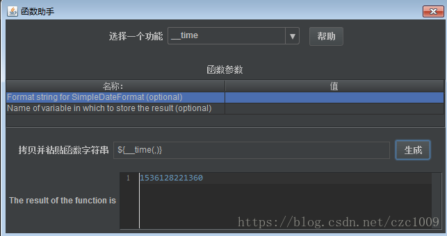
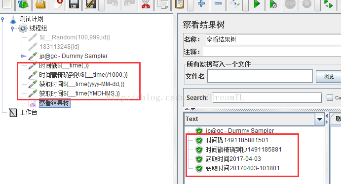

有时在接口测试时，其参数需要为时间戳或者是日期格式的数据。针对此问题，可以使用JMeter自带的_time 函数来解决以上问题

操作步骤：

1、通过函数助手，生成一个_time 函数：

2、如果参数为时间戳，那公式为：

${__time(,)} ： 默认该公式精确到毫秒级别， 13位数

${__time(/1000,)} ： 该公式精确到秒级别， 10位数

3、 如果参数需要为当前日期，那公式为：

${__time(yyyy-MM-dd,)}

${__time(YMDHMS,)}

精确到秒：${__time(yyyy-MM-dd HH:mm:ss,)}

4、执行结果为：

