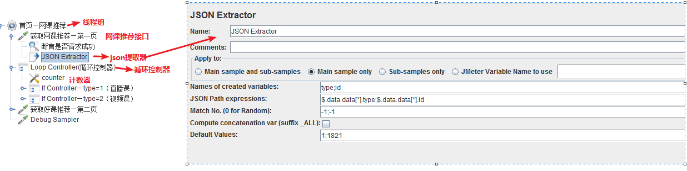

ForEach Controller只支持一个变量作为输入，但是有时候我们其它的输入变量也同步随着ForEach Controller中的变量值不同而不同，我们需要使用多个变量作为输入变量。比如如下场景：

访问网课推荐接口得到的部分json数据如下：

```json
{
    "status": "0",
    "msg": "操作成功",
    "data": {
        "data": [
            {
                "type": "2",
                "class_type": "1",
                "old_price": "298",
                "lesson_price": "298",
                "new_price": "298",
                "st_time": 1,
                "subject_id": "58",
                "id": "321913",
                "course_name": "1-2年级数学计算专项满分冲刺营",
                "class_pic": "https://xuexi8.oss-cn-beijing.aliyuncs.com/lilclpic/lilclpic_1593159188130.png?x-oss-process=style/thumb4",
                "yuyue": "0",
                "start_time": "",
                "near_time": "",
                "chapter_num": 9,
                "buy_num": "250",
                "lesson_type_name": "",
                "boruizhi": "",
                "brand_name": "小数点数学",
                "subject_type": "1",
                "material": 2,
                "materialPrice": "1"
            },
            {
                "type": "2",
                "class_type": "1",
                "old_price": "298",
                "lesson_price": "298",
                "new_price": "298",
                "st_time": 1,
                "subject_id": "27",
                "id": "321915",
                "course_name": "4年级数学计算专项满分冲刺营",
                "class_pic": "https://xuexi8.oss-cn-beijing.aliyuncs.com/lilclpic/lilclpic_1593159397174.png?x-oss-process=style/thumb4",
                "yuyue": "0",
                "start_time": "",
                "near_time": "",
                "chapter_num": 6,
                "buy_num": "196",
                "lesson_type_name": "",
                "boruizhi": "",
                "brand_name": "小数点数学",
                "subject_type": "1",
                "material": 2,
                "materialPrice": "1"
            }
        ],
        "page": {
            "pagenum": 2,
            "pagenow": 1
        }
    }
}
```

在请求网课推荐接口后，需要遍历提取该接口返回的课程id和课程类型type；需要通过判断type类型（type=1（直播课），type=2（视频课）），对查看课程详情接口进行关联；

- 如果type=1，则访问直播课接口url

- 如果type=2，则访问视频课接口url

  但是ForEach只支持一个变量输入，所以无法通过ForEach循环遍历得到id和type的值；

## **解决办法**

然而ForEach只支持一个变量的输入，我们怎么引用2个变量呢？这里我们无法通过ForEach控制器直接处理，我们需要借助Jmeter __V函数和计数器以及循环控制器来实现

备注：__V函数可以嵌套函数使用

### 使用json Extractor提取网课推荐课程所有的type和id

具体json提取设置方法如下图



##### 添加循环控制器，设置循环次数（可以根据数据量灵活设置），这里设置为10


##### 添加计数器


##### 在线程组添加Debug Sampler，可以查看提取到的变量信息

我们可以看到，id和type分别被匹配到了十次，每个变量通过下标进行区分，所以可以使用V函数和技术器来得到每次循环时type和id的值：

counter取值范围是1—10

type:${_*V(type*${counter})}

id:${_*V(id*${counter})}


##### 在循环控制器下添加两个IF Controler，一个判断type=1时打开直播课链接，另一个判断type=2时打开视频课链接


至此，便可实现不同type类型，打开不同链接的目的