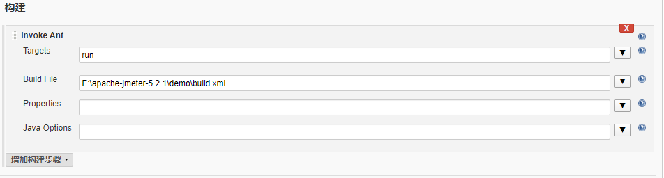

# 搭建接口自动化测试环境

__一、jmeter __ 
我用的jmeter5.2.1   jmeter要运行，必须本地有java环境，所以需要配置jdk什么的，自行配置
二、ant
安装ant
第一步：下载ant  http://ant.apache.org/
 __第二步：配置ant __ 
 __window中设置 __ant环境变量__ ：__ 
 __以下是我电脑ant配置__ 
ANT_HOME    C:\apache-ant-1.10.7
path             C:\apache-ant-1.10.7\bin
classpath      C:\apache-ant-1.10.7\lib
cmd打开 输入ant执行


说明ant安装成功！因为ant默认运行build.xml文件，build.xml 需要我们自己建立，等哈后面 我们再说这个
为了确定真的安装成功了  我们执行ant -version


__三、将\apache-jmeter-5.2.1\extras下面的ant-jmeter-1.1.1的jar包到ant的lib目录__

 __四、建立build.xml__ 


从上图可以知道  我们创建了一个文件夹demo，然后把build.xml 丢在它下面了

``` 
<?xml version="1.0" encoding="UTF-8"?>
<project name="ant-jmeter-test" default="run" basedir=".">
    <tstamp>
        <format property="time" pattern="yyyyMMddhhmm" />
    </tstamp>
    <!-- 需要改成自己本地的 Jmeter 目录-->  
    <property name="jmeter.home" value="E:\apache-jmeter-5.2.1" />
    <!-- jmeter生成jtl格式的结果报告的路径--> 
    <property name="jmeter.result.jtl.dir" value="E:\apache-jmeter-5.2.1\demo\report\jtl" />
    <!-- jmeter生成html格式的结果报告的路径-->
    <property name="jmeter.result.html.dir" value="E:\apache-jmeter-5.2.1\demo\report\html" />
    <!-- 生成的报告的前缀-->  
    <property name="ReportName" value="TestReport" />
    <property name="jmeter.result.jtlName" value="${jmeter.result.jtl.dir}/${ReportName}${time}.jtl" />
    <property name="jmeter.result.htmlName" value="${jmeter.result.html.dir}/${ReportName}${time}.html" />
    
    <target name="run">
        <antcall target="test" />
        <antcall target="report" />
    </target>
    
    <target name="test">
        <taskdef name="jmeter" classname="org.programmerplanet.ant.taskdefs.jmeter.JMeterTask" />
        <jmeter jmeterhome="${jmeter.home}" resultlog="${jmeter.result.jtlName}">
             <!-- 声明要运行的脚本。"*.jmx"指包含此目录下的所有jmeter脚本-->
            <testplans dir="E:\apache-jmeter-5.2.1\demo" includes="*.jmx" />
            <property name="jmeter.save.saveservice.output_format" value="xml"/>
        </jmeter>
    </target>
    <path id="xslt.classpath">
        <fileset dir="${jmeter.home}/lib" includes="xalan*.jar"/>
        <fileset dir="${jmeter.home}/lib" includes="serializer*.jar"/>
    </path> 
    <target name="report">
        <tstamp><format property="report.datestamp" pattern="yyyy/MM/dd HH:mm"/></tstamp>
        <xslt 
              classpathref="xslt.classpath"
              force="true"
              in="${jmeter.result.jtlName}"
              out="${jmeter.result.htmlName}"
              style="${jmeter.home}/extras/jmeter-results-report-loadtest.xsl">
              <param name="dateReport" expression="${report.datestamp}"/>
        </xslt>
                <!-- 因为上面生成报告的时候，不会将相关的图片也一起拷贝至目标目录，所以，需要手动拷贝 --> 
        <copy todir="${jmeter.result.html.dir}">
            <fileset dir="${jmeter.home}/extras">
                <include name="collapse.png" />
                <include name="expand.png" />
            </fileset>
        </copy>
    </target>
</project>
```

上图注释已经很清晰了，只需要配置下jmeter路径以及报告样式就可以使用我这个build.xml文件了

 __五、创建一个jmx文件 然后运行下__ 


上图的BUILD SUCCESSFUL 证明已经成功了，而且报告在report/html下面,现在我们打开报告看看

 

报告是不是很好看，其实就是\apache-jmeter-3.2\extras这个目录下jmeter-results-report-loadtest.xsl这个样式生成的报告 

__六、集成jenkins__ 
打开jenkins，网址为
http://192.168.1.98:8080/jenkins/
创建一个自由风格的项目。

 

选择第一个自由风格，然后点击确定按钮

   

然后配置ant，增加build路径

  

  

点击保存之后，我们继续配置测试报告
我们需要下载一个插件HTML Publisher 
系统管理----》管理插件----》可选插件(如果已经安装使用时就不用安装该插件)   输入HTML Publisher 进行查询并进行安装
接下来继续配置报告
点击增加构建后操作步骤  并点击Publish HTML reports

 

并点击保存按钮  好了  现在我们报告也配置好了 ，点击Build 即可运行脚本

   

