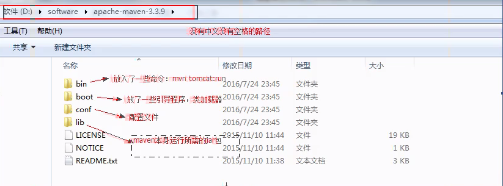
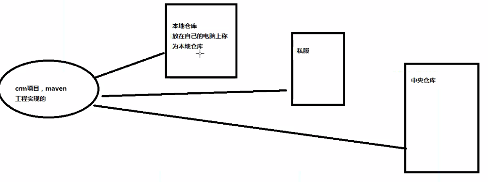
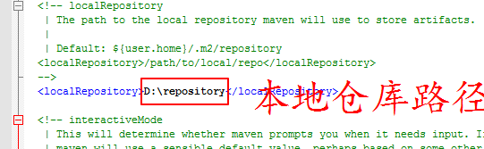

 https://developer.aliyun.com/edu/course/1207/learn?spm=5176.12901015.0.i12901015.651f525cMh40jU&accounttraceid=c5388e25585c40fb9bad5093609af489evxg#lesson/10470 

1、检查jdk的安装

2、下载Maven

-  http://maven.apache.org/download.cgi 

- 解压后把Maven的根目录配置到系统环境变量中 M2_HOME

- 在path中添加 %M2_HOME%\bin; 路径

- 测试mvn -v

- maven目录结构

  

3、仓库的配置

仓库的分类

本地仓库的配置：

修改maven安装路径下D:\Program Files\apache-maven-3.6.3\conf\settings.xml

