[TOC]
# 一、为什么要Maven

在开发中经常需要依赖第三方的包，包与包之间存在依赖关系，版本间还有兼容性问题，有时还里要将旧的包升级或降级，当项目复杂到一定程度时包管理变得非常重要。

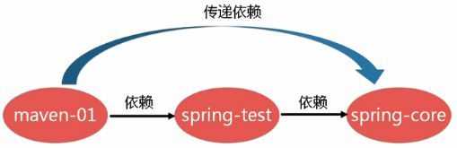


Maven是当前最受欢迎的Java项目管理构建自动化综合工具，类似以前Java中的Ant、node.js中的npm、dotNet中的nuget、PHP中的Composer。
Maven这个单词来自于意第绪语（犹太语），意为知识的积累。


Maven提供了开发人员构建一个完整的生命周期框架。开发团队可以自动完成项目的基础工具建设，Maven使用标准的目录结构和默认构建生命周期。Maven让开发人员的工作更轻松，同时创建报表，检查，构建和测试自动化设置。Maven简化和标准化项目建设过程。处理编译，分配，文档，团队协作和其他任务的无缝连接。 Maven增加可重用性并负责建立相关的任务。
每个Java项目的目录结构都没有一个统一的标准，配置文件到处都是，单元测试代码到底应该放在那里也没有一个权威的规范。
因此，我们就要用到Maven（使用Ant也可以，不过编写Ant的xml脚本比较麻烦）----一个项目管理工具。
Maven主要做了两件事：

1. 统一开发规范与工具
2. 统一管理jar包

如果**没有Maven**,你可能不得不经历下面的过程：

```java
如果使用了spring，去spring的官网下载jar包；如果使用hibernate，去hibernate的官网下载Jar包；如果使用Log4j，去log4j的官网下载jar包.....
当某些jar包有依赖的时候，还要去下载对应的依赖jar包
当jar包依赖有冲突时，不得不一个一个的排查
执行构建时，需要使用ant写出很多重复的任务代码
当新人加入开发时，需要拷贝大量的jar包，然后重复进行构建
当进行测试时，需要一个一个的运行....检查
```

有了Maven，它提供了三种功能：

> 1 依赖的管理：仅仅通过jar包的几个属性，就能确定唯一的jar包，在指定的文件pom.xml中，只要写入这些依赖属性，就会自动下载并管理jar包。
> 2 项目的构建：内置很多的插件与生命周期，支持多种任务，比如校验、编译、测试、打包、部署、发布...
> 3 项目的知识管理：管理项目相关的其他内容，比如开发者信息，版本等等

官网：[http://maven.apache.org/](https://link.zhihu.com/?target=http%3A//maven.apache.org/)
教程：[https://www.yiibai.com/maven/](https://link.zhihu.com/?target=https%3A//www.yiibai.com/maven/)
Maven库：[http://repo2.maven.org/maven2/](https://link.zhihu.com/?target=http%3A//repo2.maven.org/maven2/)
中央仓库资源：
[http://mvnrepository.com/](https://link.zhihu.com/?target=http%3A//mvnrepository.com/)
[https://search.maven.org/](https://link.zhihu.com/?target=https%3A//search.maven.org/)

# 二、安装与配置

其实主流的开发工具如IDEA、Eclipse都集成了Maven（可见重要性），但为了更加深刻的学习与管理该工具（比如多个IDE共享的问题），个人建议还是单独安装比较好。

## 2.1、官网下载安装包

在浏览器中打开下载地址：http://maven.apache.org/download.cgi

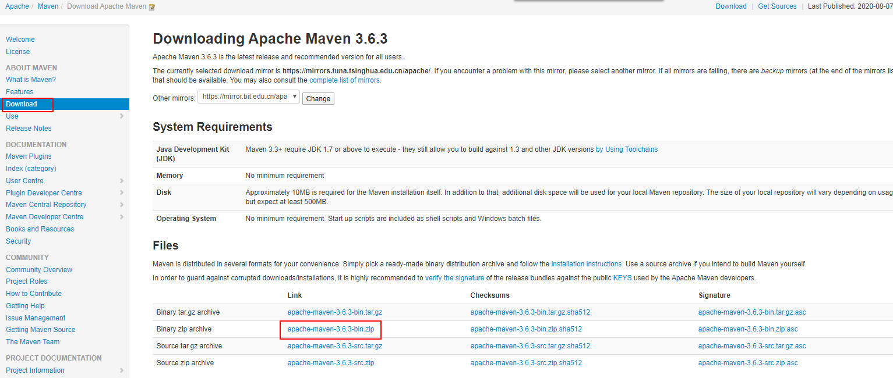

## 2.2、 配置环境变量

*注意：安装maven之前，必须先确保你的机器中已经安装了JDK，如果是Maven3则必须JDK1.7以上。*
1．解压压缩包
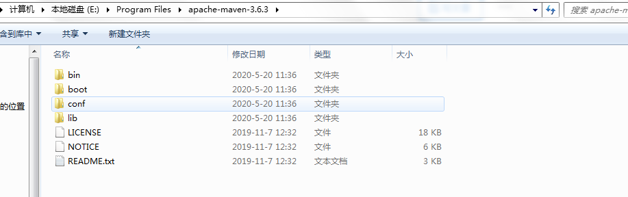

2．添加环境变量MAVEN_HOME，值为apache-maven的安装路径(没有中文)
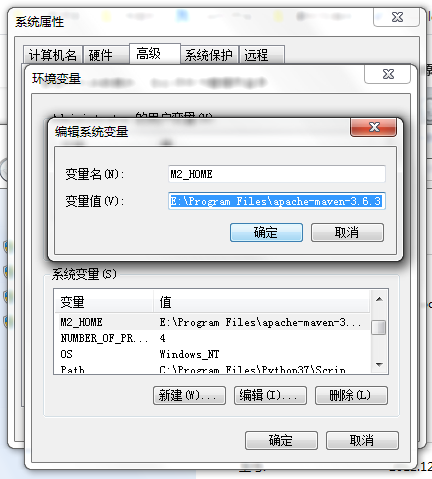

3．在Path环境变量的变量值末尾添加%MAVEN_HOME%\bin;
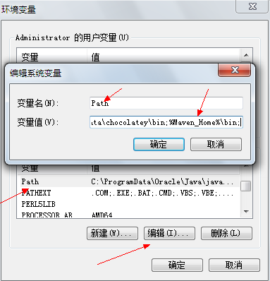

4．在cmd输入mvn –version，如果出现maven的版本信息，说明配置成功。
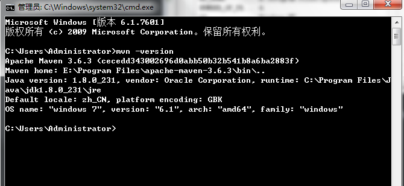

## 2.3、本地仓储配置

如果您不配置，默认会在如下位置存放从远程下载到的包：
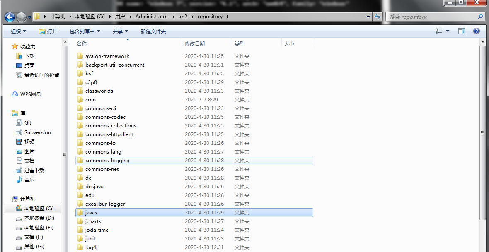

从中央仓库下载的jar包，都会统一存放到本地仓库中。我们需要配置本地仓库的位置。
打开maven安装目录，打开conf目录下的setting.xml文件。
可以参照下图配置本地仓储位置。
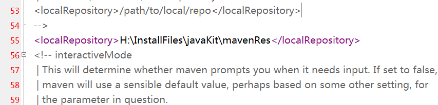

你还可以在运行时指定本地仓库位置：
mvn clean install -Dmaven.repo.local=d:\yourpath

## 2.4、中央仓库配置

当构建一个Maven项目时，首先检查pom.xml文件以确定依赖包的下载位置，执行顺序如下：
1、从本地资源库中查找并获得依赖包，如果没有，执行第2步。 2、从Maven默认中央仓库中查找并获得依赖包（[http://repo1.maven.org/maven2/](https://link.zhihu.com/?target=http%3A//repo1.maven.org/maven2/)），如果没有，执行第3步。 3、如果在pom.xml中定义了自定义的远程仓库，那么也会在这里的仓库中进行查找并获得依赖包，如果都没有找到，那么Maven就会抛出异常。
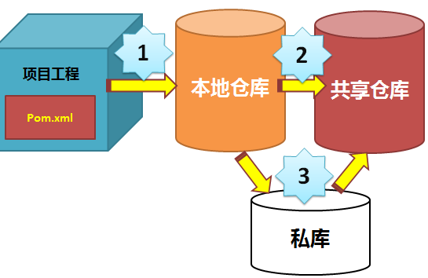

修改默认中央仓库地址
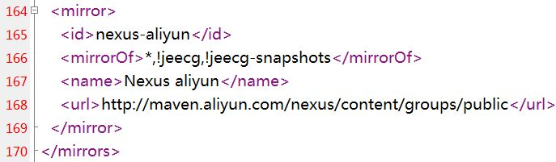

常用地址：

> 1、[http://www.sonatype.org/nexus/](https://link.zhihu.com/?target=http%3A//www.sonatype.org/nexus/) 私服nexus工具使用
> 2、[http://mvnrepository.com/](https://link.zhihu.com/?target=http%3A//mvnrepository.com/) （推荐）
> 3、[http://repo1.maven.org/maven2](https://link.zhihu.com/?target=http%3A//repo1.maven.org/maven2)
> **4、[http://maven.aliyun.com/nexus/content/groups/public/](https://link.zhihu.com/?target=http%3A//maven.aliyun.com/nexus/content/groups/public/) 阿里云 （强力推荐）**
> 5、[http://repo2.maven.org/maven2/](https://link.zhihu.com/?target=http%3A//repo2.maven.org/maven2/) 私服nexus工具使用
> 6、[http://uk.maven.org/maven2/](https://link.zhihu.com/?target=http%3A//uk.maven.org/maven2/)
> 7、[http://repository.jboss.org/nexus/content/groups/public](https://link.zhihu.com/?target=http%3A//repository.jboss.org/nexus/content/groups/public)
> 8、[http://maven.oschina.net/content/groups/public/](https://link.zhihu.com/?target=http%3A//maven.oschina.net/content/groups/public/)
> 9、[http://mirrors.ibiblio.org/maven2/](https://link.zhihu.com/?target=http%3A//mirrors.ibiblio.org/maven2/)
> 10、[http://maven.antelink.com/content/repositories/central/](https://link.zhihu.com/?target=http%3A//maven.antelink.com/content/repositories/central/)
> 11、[http://nexus.openkoala.org/nexus/content/groups/Koala-release/](https://link.zhihu.com/?target=http%3A//nexus.openkoala.org/nexus/content/groups/Koala-release/)
> 12、[http://maven.tmatesoft.com/content/groups/public/](https://link.zhihu.com/?target=http%3A//maven.tmatesoft.com/content/groups/public/)

完整配置文件：

```xml
<?xml version="1.0" encoding="UTF-8"?>
<!--
Licensed to the Apache Software Foundation (ASF) under one
or more contributor license agreements.  See the NOTICE file
distributed with this work for additional information
regarding copyright ownership.  The ASF licenses this file
to you under the Apache License, Version 2.0 (the
"License"); you may not use this file except in compliance
with the License.  You may obtain a copy of the License at
    http://www.apache.org/licenses/LICENSE-2.0
Unless required by applicable law or agreed to in writing,
software distributed under the License is distributed on an
"AS IS" BASIS, WITHOUT WARRANTIES OR CONDITIONS OF ANY
KIND, either express or implied.  See the License for the
specific language governing permissions and limitations
under the License.
-->
<!--
 | This is the configuration file for Maven. It can be specified at two levels:
 |
 |  1. User Level. This settings.xml file provides configuration for a single user,
 |                 and is normally provided in ${user.home}/.m2/settings.xml.
 |
 |                 NOTE: This location can be overridden with the CLI option:
 |
 |                 -s /path/to/user/settings.xml
 |
 |  2. Global Level. This settings.xml file provides configuration for all Maven
 |                 users on a machine (assuming they're all using the same Maven
 |                 installation). It's normally provided in
 |                 ${maven.home}/conf/settings.xml.
 |
 |                 NOTE: This location can be overridden with the CLI option:
 |
 |                 -gs /path/to/global/settings.xml
 |
 | The sections in this sample file are intended to give you a running start at
 | getting the most out of your Maven installation. Where appropriate, the default
 | values (values used when the setting is not specified) are provided.
 |
 |-->
<settings xmlns="http://maven.apache.org/SETTINGS/1.0.0"
          xmlns:xsi="http://www.w3.org/2001/XMLSchema-instance"
          xsi:schemaLocation="http://maven.apache.org/SETTINGS/1.0.0 http://maven.apache.org/xsd/settings-1.0.0.xsd">
  <!-- localRepository
   | The path to the local repository maven will use to store artifacts.
   |
   | Default: ${user.home}/.m2/repository
  <localRepository>/path/to/local/repo</localRepository>
  -->
  <localRepository>H:\InstallFiles\javaKit\mavenRes</localRepository>
  <!-- interactiveMode
   | This will determine whether maven prompts you when it needs input. If set to false,
   | maven will use a sensible default value, perhaps based on some other setting, for
   | the parameter in question.
   |
   | Default: true
  <interactiveMode>true</interactiveMode>
  -->
  <!-- offline
   | Determines whether maven should attempt to connect to the network when executing a build.
   | This will have an effect on artifact downloads, artifact deployment, and others.
   |
   | Default: false
  <offline>false</offline>
  -->
  <!-- pluginGroups
   | This is a list of additional group identifiers that will be searched when resolving plugins by their prefix, i.e.
   | when invoking a command line like "mvn prefix:goal". Maven will automatically add the group identifiers
   | "org.apache.maven.plugins" and "org.codehaus.mojo" if these are not already contained in the list.
   |-->
  <pluginGroups>
    <!-- pluginGroup
     | Specifies a further group identifier to use for plugin lookup.
    <pluginGroup>com.your.plugins</pluginGroup>
    -->
  </pluginGroups>
  <!-- proxies
   | This is a list of proxies which can be used on this machine to connect to the network.
   | Unless otherwise specified (by system property or command-line switch), the first proxy
   | specification in this list marked as active will be used.
   |-->
  <proxies>
    <!-- proxy
     | Specification for one proxy, to be used in connecting to the network.
     |
    <proxy>
      <id>optional</id>
      <active>true</active>
      <protocol>http</protocol>
      <username>proxyuser</username>
      <password>proxypass</password>
      <host>proxy.host.net</host>
      <port>80</port>
      <nonProxyHosts>local.net|some.host.com</nonProxyHosts>
    </proxy>
    -->
  </proxies>
  <!-- servers
   | This is a list of authentication profiles, keyed by the server-id used within the system.
   | Authentication profiles can be used whenever maven must make a connection to a remote server.
   |-->
  <servers>
    <!-- server
     | Specifies the authentication information to use when connecting to a particular server, identified by
     | a unique name within the system (referred to by the 'id' attribute below).
     |
     | NOTE: You should either specify username/password OR privateKey/passphrase, since these pairings are
     |       used together.
     |
    <server>
      <id>deploymentRepo</id>
      <username>repouser</username>
      <password>repopwd</password>
    </server>
    -->
    <!-- Another sample, using keys to authenticate.
    <server>
      <id>siteServer</id>
      <privateKey>/path/to/private/key</privateKey>
      <passphrase>optional; leave empty if not used.</passphrase>
    </server>
    -->
<server> 
    <id>admin</id> 
    <username>admin</username> 
    <password>admin</password>
</server>
</servers>
  <!-- mirrors
   | This is a list of mirrors to be used in downloading artifacts from remote repositories.
   |
   | It works like this: a POM may declare a repository to use in resolving certain artifacts.
   | However, this repository may have problems with heavy traffic at times, so people have mirrored
   | it to several places.
   |
   | That repository definition will have a unique id, so we can create a mirror reference for that
   | repository, to be used as an alternate download site. The mirror site will be the preferred
   | server for that repository.
   |-->
  <mirrors>
    <!-- mirror
     | Specifies a repository mirror site to use instead of a given repository. The repository that
     | this mirror serves has an ID that matches the mirrorOf element of this mirror. IDs are used
     | for inheritance and direct lookup purposes, and must be unique across the set of mirrors.
     |
    <mirror>
      <id>mirrorId</id>
      <mirrorOf>repositoryId</mirrorOf>
      <name>Human Readable Name for this Mirror.</name>
      <url>http://my.repository.com/repo/path</url>
    </mirror>
     -->
  <mirror>
    <id>nexus-aliyun</id>  
    <mirrorOf>*,!jeecg,!jeecg-snapshots</mirrorOf>  
    <name>Nexus aliyun</name>  
    <url>http://maven.aliyun.com/nexus/content/groups/public</url>  
  </mirror>
</mirrors>
  <!-- profiles
   | This is a list of profiles which can be activated in a variety of ways, and which can modify
   | the build process. Profiles provided in the settings.xml are intended to provide local machine-
   | specific paths and repository locations which allow the build to work in the local environment.
   |
   | For example, if you have an integration testing plugin - like cactus - that needs to know where
   | your Tomcat instance is installed, you can provide a variable here such that the variable is
   | dereferenced during the build process to configure the cactus plugin.
   |
   | As noted above, profiles can be activated in a variety of ways. One way - the activeProfiles
   | section of this document (settings.xml) - will be discussed later. Another way essentially
   | relies on the detection of a system property, either matching a particular value for the property,
   | or merely testing its existence. Profiles can also be activated by JDK version prefix, where a
   | value of '1.4' might activate a profile when the build is executed on a JDK version of '1.4.2_07'.
   | Finally, the list of active profiles can be specified directly from the command line.
   |
   | NOTE: For profiles defined in the settings.xml, you are restricted to specifying only artifact
   |       repositories, plugin repositories, and free-form properties to be used as configuration
   |       variables for plugins in the POM.
   |
   |-->
  <profiles>
    <!-- profile
     | Specifies a set of introductions to the build process, to be activated using one or more of the
     | mechanisms described above. For inheritance purposes, and to activate profiles via <activatedProfiles/>
     | or the command line, profiles have to have an ID that is unique.
     |
     | An encouraged best practice for profile identification is to use a consistent naming convention
     | for profiles, such as 'env-dev', 'env-test', 'env-production', 'user-jdcasey', 'user-brett', etc.
     | This will make it more intuitive to understand what the set of introduced profiles is attempting
     | to accomplish, particularly when you only have a list of profile id's for debug.
     |
     | This profile example uses the JDK version to trigger activation, and provides a JDK-specific repo.
    <profile>
      <id>jdk-1.4</id>
      <activation>
        <jdk>1.4</jdk>
      </activation>
      <repositories>
        <repository>
          <id>jdk14</id>
          <name>Repository for JDK 1.4 builds</name>
          <url>http://www.myhost.com/maven/jdk14</url>
          <layout>default</layout>
          <snapshotPolicy>always</snapshotPolicy>
        </repository>
      </repositories>
    </profile>
    -->
    <!--
     | Here is another profile, activated by the system property 'target-env' with a value of 'dev',
     | which provides a specific path to the Tomcat instance. To use this, your plugin configuration
     | might hypothetically look like:
     |
     | ...
     | <plugin>
     |   <groupId>org.myco.myplugins</groupId>
     |   <artifactId>myplugin</artifactId>
     |
     |   <configuration>
     |     <tomcatLocation>${tomcatPath}</tomcatLocation>
     |   </configuration>
     | </plugin>
     | ...
     |
     | NOTE: If you just wanted to inject this configuration whenever someone set 'target-env' to
     |       anything, you could just leave off the <value/> inside the activation-property.
     |
    <profile>
      <id>env-dev</id>
      <activation>
        <property>
          <name>target-env</name>
          <value>dev</value>
        </property>
      </activation>
      <properties>
        <tomcatPath>/path/to/tomcat/instance</tomcatPath>
      </properties>
    </profile>
    -->
<profile>   
    <id>jdk1.7</id>    
    <activation>   
        <activeByDefault>true</activeByDefault>    
        <jdk>1.7</jdk>   
    </activation>    
    <properties>   
        <maven.compiler.source>1.7</maven.compiler.source>    
        <maven.compiler.target>1.7</maven.compiler.target>    
        <maven.compiler.compilerVersion>1.7</maven.compiler.compilerVersion>   
    </properties>   
</profile>  
</profiles>
  <!-- activeProfiles
   | List of profiles that are active for all builds.
   |
  <activeProfiles>
    <activeProfile>alwaysActiveProfile</activeProfile>
    <activeProfile>anotherAlwaysActiveProfile</activeProfile>
  </activeProfiles>
  -->
</settings>
```

## 2.5、命令行创建maven项目

方法一：
输入命令 mvn archetype:generate，按回车，根据提示输入参数，如果是第一次使用，需要下载插件，稍等几分钟即可。
切换目录，输入指令
选择骨架（模板）:
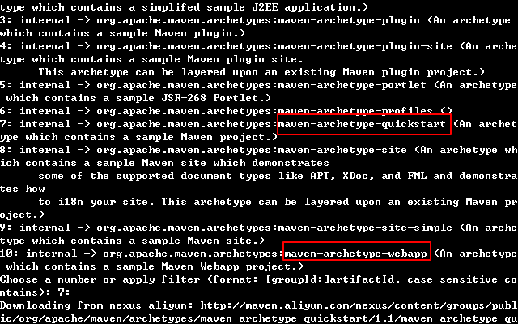

输入坐标：

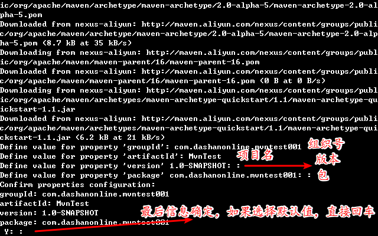

确认后下载骨架，成功后的提示如下：

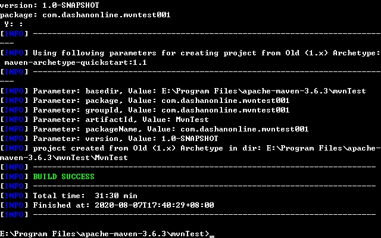

将项目转换成IDEA项目：

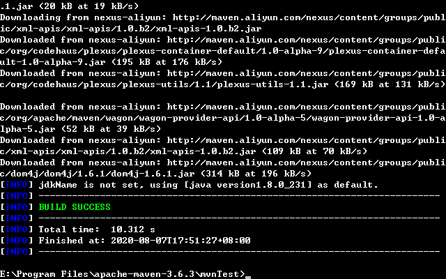

成功后可以看到增加了项目信息:
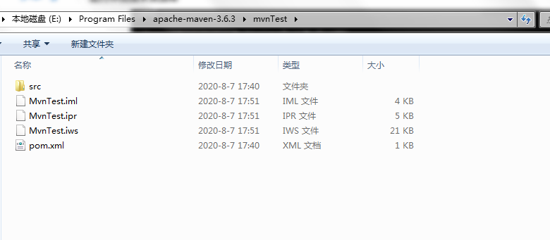

将项目打包
输入指令：mvn package

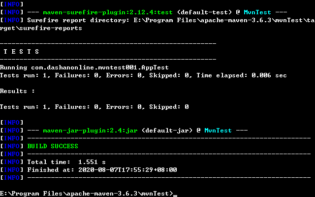

打包成功后：
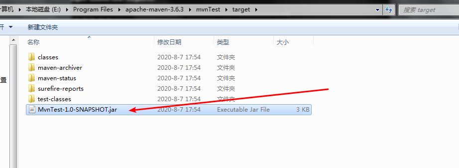

方法二：
在命令中指定参数

```
mvn archetype:generate -DgroupId=com.mycompany.app -DartifactId=myapp -DarchetypeArtifactId=maven-archetype-quickstart -DinteractiveMode=false
```

执行结果：
在命令行输入：mvn archetype:generate -DgroupId=com.dashanonline.mvntest001 -DartifactId=MvnTest -DarchetypeArtifactId=maven-archetype-quickstart -DinteractiveMode=false
在命令行输入指令时请注意当前目录：
成功提示：

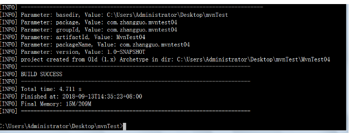

新建一个简单web项目

```shell
mvn archetype:generate -DgroupId=com.zhangguo  -DartifactId=webappdemo  -Dpackage=com.zhangguo.webappdemo  -DarchetypeArtifactId=maven-archetype-webapp   -Dversion=1.0 -DinteractiveMode=No
```

如果下载骨架的速度太慢，可以用-DarchetypeCatalog=指定下载位置，如下所示

```xml
mvn archetype:generate \
    -DgroupId=com.mycom.helloworld \
    -DartifactId=helloworld \
    -DarchetypeArtifactId=maven-archetype-quickstart \
    -DinteractiveMode=false \
    -DarchetypeCatalog=http://maven.aliyun.com/nexus/content/groups/public/
```


## 2.6、Jetty运行Web项目

## 2.7、在tomcat中运行
# 三、Maven概要
## 3.1、Maven名词解释
## 3.2、Maven的生命周期
## 3.3、Maven标准工程结构
## 3.4、Maven的"约束优于配置"
## 3.5、Maven的版本规范
## 3.6、项目骨架Maven Archetype
## 3.7、maven的项目对象模型
# 四、IDE中使用Maven（IDEA或Eclipse）
## 4.1、将现有项目转换成Maven项目
## 4.2、在IDEA中创建Maven项目
### 4.2.1、创建项目
### 4.2.2、配置Tomcat
### 4.2.3、war和war exploded的区别
### 4.2.4、修改项目结构
### 4.2.5、不能添加Servlet的解决方法
## 4.3、在Eclipse中创建Maven工程
### Maven插件
### Maven环境配置
### 创建Maven工程
## 4.4、使用Maven进行构建
## 4.5、创建Maven多模块项目
### 4.5.1、maven多模块优点
### 4.5.2、在IDEA中创建多模块项目
## 4.6、多模块项目依赖管理与依赖继承
### 4.6.1、指定父模块与默认继承
### 4.6.2、依赖管理
# 五、Maven中常用指令使用
## 5.1、在命令行中使用Maven指令
## 5.2、常用Maven命令
## 5.3、在IDE（集成开发工具）中使用指令
### 5.3.1、工具栏介绍
### 5.3.2、快捷执行Maven命令
# 六、使用指导
## 6.1、如何添加外部依赖jar包
## 6.2、如何寻找jar包
## 6.3、如何使用Maven插件(Plugin)
## 6.4、如何一次编译多个工程
## 6.5、常用Maven插件
# 七、常见问题
## 7.1、dependencies和dependencyManagement，plugins和pluginManagement的区别？
## 7.2、不能添加Servlet
# 八、综合示例
# 九、视频
# 十、作业
