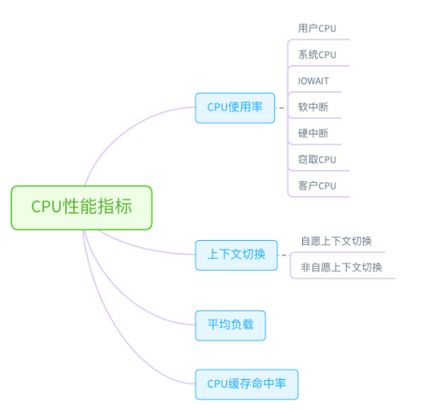
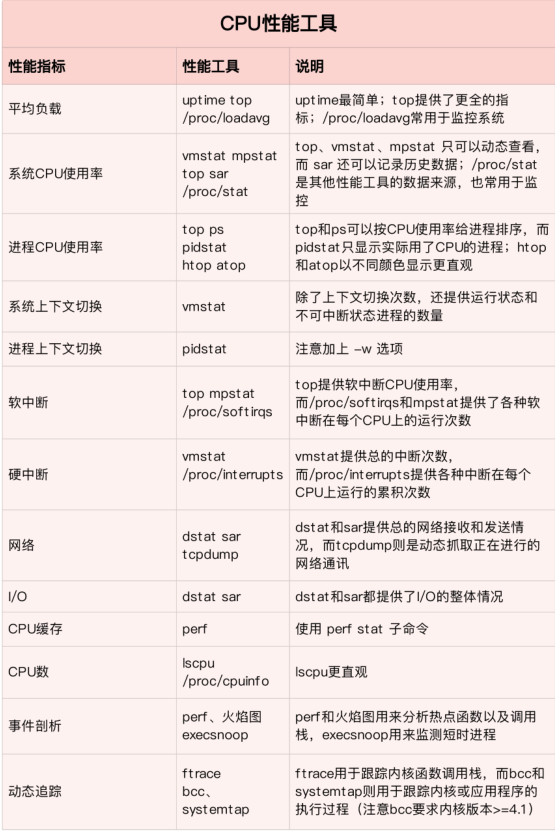
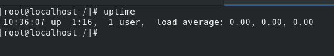

**性能工具速查**

​		在梳理性能工具之前，首先给你提一个问题，那就是，在什么情况下，我们才需要去查找、挑选
性能工具呢？你可以先自己想一下，再继续下面的内容。

​	其实在我看来，只有当你想了解某个性能指标，却不知道该怎么办的时候，才会想到，“要是有一个性能工具速查表就好了”这个问题。如果已知一个性能工具可用，我们更多会去查看这个工具的手册，找出它的功能、用法以及注意事项。
​		关于工具手册的查看，man 应该是我们最熟悉的方法，我在专栏中多次介绍过。实际上，除了
man 之外，还有另外一个查询命令手册的方法，也就是 info。
​		info 可以理解为 man 的详细版本，提供了诸如节点跳转等更强大的功能。相对来说，man 的输
出比较简洁，而 info 的输出更详细。所以，我们通常使用 man 来查询工具的使用方法，只有在man 的输出不太好理解时，才会再去参考 info 文档。
​		当然，我说过了，要查询手册，前提一定是已知哪个工具可用。如果你还不知道要用哪个工具，
就要根据想了解的指标，去查找有哪些工具可用。这其中：
​		有些工具不需要额外安装，就可以直接使用，比如内核的 /proc 文件系统；
​		而有些工具，则需要安装额外的软件包，比如 sar、pidstat、iostat 等。

​		所以，在选择性能工具时，除了要考虑性能指标这个目的外，还要结合待分析的环境来综合考
虑。比如，实际环境是否允许安装软件包，是否需要新的内核版本等

​		那么，有没有更好的方法来理解这些工具呢？ 我的建议，还是从性能指标出发，根据性能指标的
不同，将性能工具划分为不同类型。比如，最常见的就是可以根据 CPU、内存、磁盘 I/O 以及网
络的各类性能指标，将这些工具进行分类。
接下来，我就从 CPU、内存、磁盘 I/O 以及网络等几个角度，梳理这些常见的 Linux 性能工具，
特别是从性能指标的角度出发，理清楚到底有哪些工具，可以用来监测特定的性能指标。这些工
具，实际上贯穿在我们专栏各模块的各个案例中。为了方便你查看，我将它们都整理成了表格，
并增加了每个工具的使用场景

CPU性能工具

首先，从CPU的角度来说，主要的性能指标就是CPU的使用率、上下文切换以及CPU cache的命中率，下面这张图就列出了常见的CPU性能指标。

1. 平均负载

   **uptime：**

   DESCRIPTION
          uptime  gives  a one line display of the following information.  The current time,how long the system has been running, how many users are currently logged on,  and the system load averages for the past 1, 5, and 15 minutes.

      This is the same information contained in the header line displayed by w(1).

      System  load  averages  is  the  average  number of processes that are either in a runnable or uninterruptable state.  A process in a runnable state is either  using	the  CPU or waiting to use the CPU.  A process in uninterruptable state is waiting	for some I/O access, eg waiting for disk.  The averages are taken over  the  three	time intervals.  Load averages are not normalized for the number of CPUs in a system, so a load average of 1 means a single CPU system is loaded all the time while	on a 4 CPU system it means it was idle 75% of the time.

   OPTIONS
          -p, --pretty
                 show uptime in pretty format

     	 -h, --help
             	display this help text

      	-s, --since
             	system up since, in yyyy-mm-dd HH:MM:SS format

     	 -V, --version
            	 display version information and exit

   uptime命令执行结果分别为：当前时间，系统运行时间，登录用户个数，过去1、5、15分钟系统的平均负载

   

   **top：**

   

   **/proc/loadavg:**

2. 