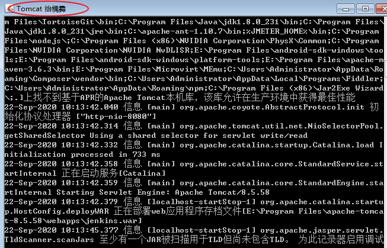
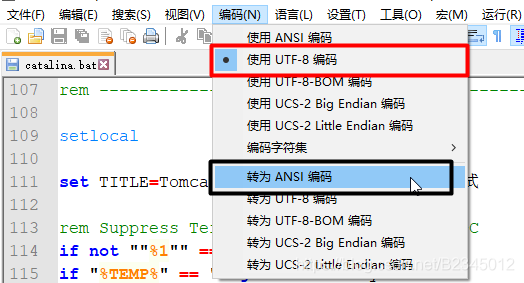

1、tomcat启动窗口乱码

找到**Tomcat**目录下**conf**文件夹中的**logging.properties**文件，
将java.util.logging.ConsoleHandler.encoding = UTF-8修改为：

```xml
java.util.logging.ConsoleHandler.encoding = GBK
```

2、tomcat标题乱码



我常用的Tomcat标题的命名有下面两种：
首先找到Tomcat目录下**bin**目录下的**catalina.bat**文件，用记事本打开：

**第一种：**在这个地方写这么一句：

```bat
set TITLE=Tomcat 8.5.38 这里是标题乱码测试
```

**第二种**  在Tomcat原来标题的位置写标题：
if "%TITLE%" == "" set TITLE=Tomcat 窗口

标题位置出现了乱码，这个时候可以用Notepad++来调整文件的编码：
