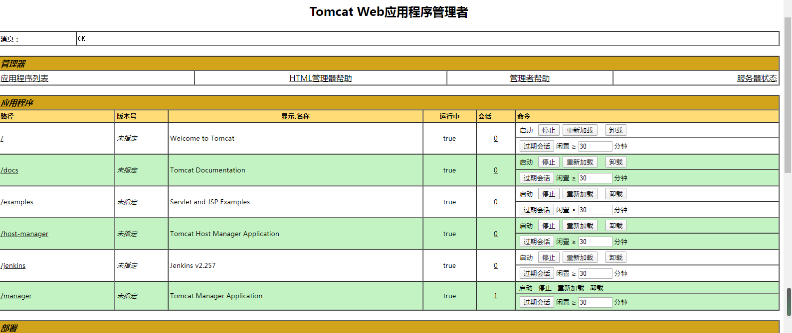

因为安全原因，tomcat管理后台默认是关闭的，但是为了方便管理和项目的界面化部署，我们可以通过修改配置文件来启用tomcat后台管理页面，开启后台管理，需要修改配置文件如下：

## 1 、修改conf/tomcat-users.xml

```xml
<role rolename="admin-gui"/>
<role rolename="manager-gui"/>
<role rolename="manager-jmx"/>
<role rolename="manager-script"/>
<role rolename="manager-status"/>
<user username="tomcat" password="tomcat" roles="admin-gui,manager-gui,manager-jmx, manager-script,manager-status"/>
```

## 2、修改webapps/manager/META-INF/context.xml

```xml
<Valve className="org.apache.catalina.valves.RemoteAddrValve"         allow="^.*$" /> 
```

## 3 重启Tomcat 并登录

