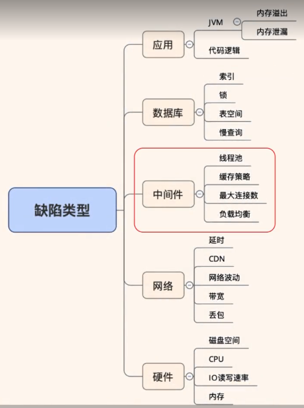
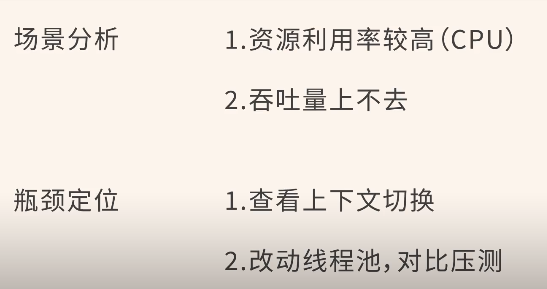
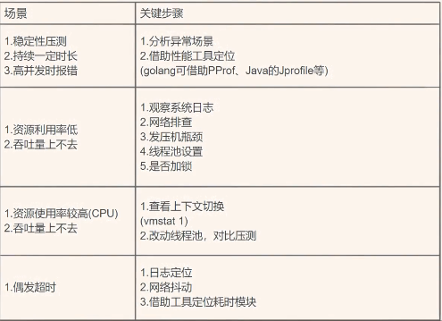

一、压测的目的

1、找出性能瓶颈
2、不清楚现有服务的性能情况，想通过极限压测给出性能指标
3、给出预期的性能指标后，通过压测去判断当前集群是否能够达到要求，也就是通过压测预判系统是否需要扩容

有了目的以后，压测会更有针对性，包括如何设计更合理的压测计划，以及对压测中可能遇到的问题，有一个提前的把控，以便于我们实时修改压测方案，进而更快速的达到压测目的，找到瓶颈点。

二、性能测试中比较常见的性能瓶颈

1、内存泄漏：上面这些工具对分析内存泄漏，线程死锁等一些常见问题比较专业

2、吞吐量上不去：

（1）观察系统日志，不同并发时是否有业务异常
（2）网络问题，通过切换不同网络，判断是不是有宽带限制，如果有限制，可以通过增加宽带，基本就能解决问题
（3）发压机瓶颈
可以通过这个命令查看TIME_WAIT的数量
netstat -an|awk '/tcp/{print$6}'|sort|uniq -c
(4)线程池设置不合理了

（5）代码中存在加锁情况 
（6）CPU瓶颈

