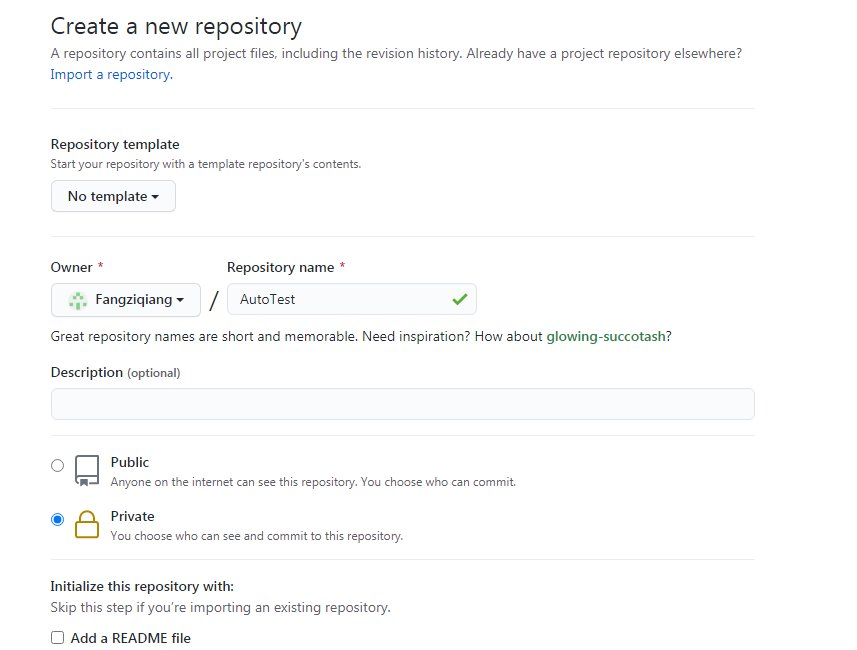
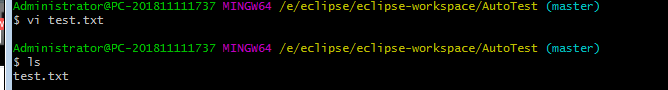
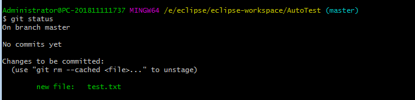
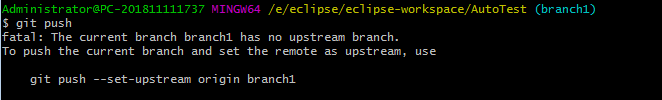

**4-6 创建git仓库及克隆、拉取和推送操作**

**1、创建git仓库**

登录github网站（https://github.com/），新建一个repository，



**项目创建成功后，两种项目初始化的方式：**

方式一：create a new repository on the command line

```shell
echo "# AutoTest" >> README.md
git init
git add README.md
git commit -m "first commit"
git branch -M main
git remote add origin git@github.com:Fangziqiang/AutoTest.git
git push -u origin main
```

方式二：push an existing repository from the command line

```shell
git remote add origin git@github.com:Fangziqiang/AutoTest.git
git branch -M main
git push -u origin main
```

**2、克隆仓库**

```shell
git clone git@github.com:Fangziqiang/AutoTest.git
```

**3、推送**

在AutoTest目录新建test.txt文件



向仓库中追加文件：git add test.txt
在使用git add提交多个文件的方式：
git add .   后面加一个“.”，匹配所有的文件
总结下，提交多个文件时，git add后可以有如下参数以及参数的解释:
git add .                               提交被修改的和新建的文件，但不包括被删除的文件                            
git add -u     --update          update tracked files    更新所有改变的文件，即提交所有变化的文件
git add -A    --all                  add changes from all tracked and untracked files   提交已被修改和已被删除文件，但是不包括新的文件

git add -u     --update          update tracked files    更新所有改变的文件，即提交所有变化的文件

查询git状态：git status



输入提交说明文件：git commit -m "增加测试文件"

推送：git push

```shell
$ git push
Counting objects: 3, done.
Writing objects: 100% (3/3), 232 bytes | 232.00 KiB/s, done.
Total 3 (delta 0), reused 0 (delta 0)
To github.com:Fangziqiang/AutoTest.git

 * [new branch]      master -> master
```

**4、推送**

```shell
git pull
```

**4-7 git分支操作**

1、查看分支

查看本地分支：git branch
查看所有分支：git branch -a

2、创建分支

在本地创建分支：$ git checkout -b branch1

在branch1修改test.txt文件，在文件末尾追加“222  branc1”文本信息，然后追加并推送文件

```shell
git add test.txt
git commit -m "提交到分支1上的内容“
git push
```



使用 git push --set-upstream origin branch1进行推送

3、删除分支

$ git checkout master 	切换到master分支
$ git branch -d branch1	删除本地分支
$ git branch -r -d origin/branch1	删除远程分支
$ git push origin :branch1	推送修改结果

$ git branch -r -d origin/branch1

4、合并分支
$ git checkout -b mergedemo	#增加分支mergedemo
$ git add test.txt	#追加test.txt文件
$ git commit -m "增加合并内容"	#添加文本说明
$ git push --set-upstream origin mergedemo	#推送到远程分支

$ git checkout master  	#切换到master分支
$ git merge mergedemo	#合并mergedemo分支到本分支（master）

5、结局合并分支的冲突问题
